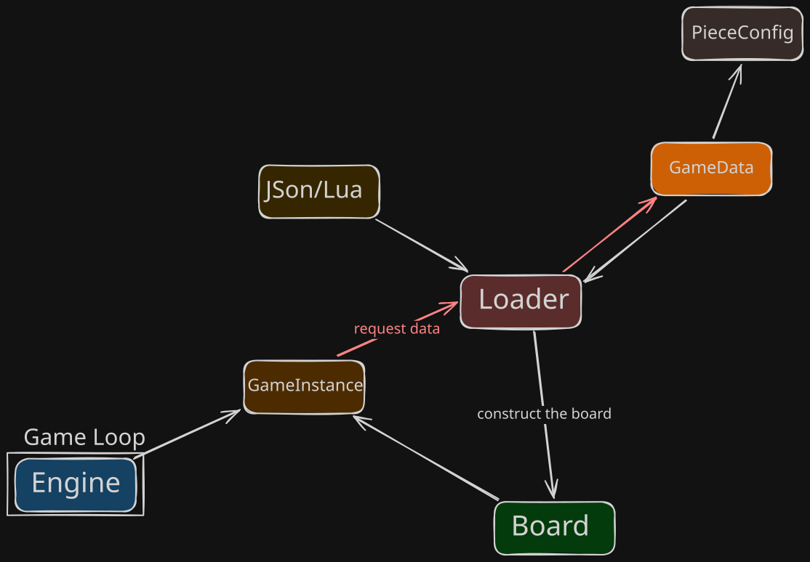

# chess
A (to be) complete chess webapp.
Engine is written in C++ and exposed through a backend API for a TypeScript webapp.

<!-- progress ❌✅ -->
## Current progress:

    C++ Engine:
        - ✅ Foundation and structure
        - ✅ Decoding and parsing of data
        - ❌ Logic and functionality (In progress)
        - ❌ Community modding interface
    
    TypeScript Webapp: TBA

## Architecture

